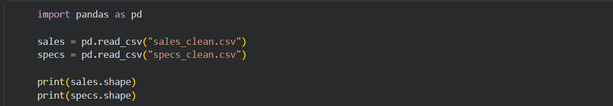

# Evidencias del proceso en Colab

## 1. Carga de archivos de entrada

En esta evidencia se observa la carga de los archivos `sales_clean.csv` y `specs_clean.csv`, que sirven como base para el proceso de integración.

## 2. Unión inicial de datasets

Aquí se muestra la lectura de ambos datasets y la construcción del merge inicial entre ventas y especificaciones.

## 3. Validación del match final

En esta salida se evidencia el porcentaje de coincidencia alcanzado después de aplicar correcciones manuales a modelos problemáticos.

## 4. Generación del dataset procesado

Aquí se observa la creación del archivo `dataset_processed_colab.csv`, que corresponde a la versión final procesada del dataset en Colab.

## 5. Evidencia del análisis exploratorio

Esta gráfica muestra uno de los análisis realizados sobre el dataset final, como apoyo a la interpretación de resultados.
